# 总线分析工具

在自己的 Linux 电脑上想方便快捷地查看总线信号数值变化和波形变化趋势特别不容易，因此想到制作一款跨平台的工具来满足这个要求。

一款基于 Web 的可视化查看总线报文的工具。

## 如何编译&打包该项目

该项目使用了 Quasar 框架完成 UI 设计，遵循 Quasar 框架要求编译&打包即可。

```bash
# 首先clone本项目
git clone https://github.com/AmnesiaBeing/zzh-bus-analyzer
# 进入项目zulu
cd zzh-bus-analyzer
# 通过包管理器更新所需依赖
yarn
# 调试应用
yarn quasar dev
# 打包应用
yarn quasar build
# 如需打包成Electron跨平台应用，请参考Quasar框架指令，譬如：
yarn quasar build --mode electron
```

## 项目一级功能清单

1. 解析总线信号格式，如 DBC 等（后期拓展 ARXML）
2. 解析报文记录，如 ASC 等（后期拓展 BLF、PCAP 等）
3. 解析信号波形，根据总线信号格式
4. 实时解析/回放解析，针对目标操作系统来支持不同的解析方式

## 项目主要架构与系统框图

支持的平台类型如下：

|            |          |                                                      Web 端                                                      | 桌面端                                              | 移动端（暂不考虑） |
| :--------: | -------- | :--------------------------------------------------------------------------------------------------------------: | --------------------------------------------------- | ------------------ |
|    前端    | 加速运算 |                                                       WASM                                                       |                                                     | ——                 |
|            | UI 框架  |                                                   Quasar 自带                                                    |                                                     | ——                 |
| 前后端通信 |          |                                                    web-socket                                                    |                                                     | ——                 |
|    后端    |          | 服务端不提供任何支持功能，仅负责运行前端<br />（后期拓展）提供通过 web-socket 转发本地数据采集服务至前端的小应用 | Electron 底层通过 web-socket 协议转发信号至上层应用 | ——                 |

系统数据流向图如图所示：



系统框图如图所示：

（系统框图待定）

## UI 设计

按照常见 IDE 工具的 UI 进行设计，分为顶部栏、侧边栏、底部栏、主要内容、常见弹窗共 4 个部分，示意图如图所示。



注意：暂时先不实现页面选项卡功能！！当前仅支持单记录文件+单总线描述文件。

## 模块设计

### 顶部栏

顶部栏拥有以下元素：

|  #  |           内容           |                                                                                                                                 功能说明                                                                                                                                 |
| :-: | :----------------------: | :----------------------------------------------------------------------------------------------------------------------------------------------------------------------------------------------------------------------------------------------------------------------: |
|  1  |           Logo           |                                                                                                                显示 Logo，当且仅当处于 Desktop 模式下显示                                                                                                                |
|  2  |          菜单栏          |                                                                                                             靠近左侧显示菜单，每个菜单项之间要考虑触屏的间距                                                                                                             |
|  3  |       菜单栏-文件        |                                                                                                               在 Desktop 模式下，使用快捷键 Alt+F 快速选中                                                                                                               |
|  4  |     菜单栏-文件-打开     | 1. 当选择 DBC 等总线信号描述文件时，加载文件到内存中，若此时没有打开其他窗口，进入总线描述文件编辑界面；<br />2. 当选择总线记录文件时，若没有加载总线描述文件时，加载总线记录文件的二进制流文件，若已加载符合的<br />在 Desktop 模式下，使用快捷键 Ctrl+O 快速选中<br /> |
|  5  | 菜单栏-文件-打开最近文件 |                                                                                                   记录曾经打开过的所有文件，使用分割线分割总线描述与报文两种类型的文件                                                                                                   |
|  6  |     菜单栏-文件-保存     |                                                                                        当且仅当在编辑总线描述文件时显示<br />在 Desktop 模式下，使用快捷键 Ctrl+S 快速选中<br />                                                                                         |
|  7  |     菜单栏-文件-退出     |                                                                                                                                 退出应用                                                                                                                                 |
|  8  |       菜单栏-编辑        |                                                                                                               在 Desktop 模式下，使用快捷键 Alt+E 快速选中                                                                                                               |
|  9  |     菜单栏-编辑-撤销     |                                                                                                                          撤销上一步操作，Ctrl+Z                                                                                                                          |
| 10  |     菜单栏-编辑-恢复     |                                                                                                                          恢复下一步操作，Ctrl+Y                                                                                                                          |
| 11  |     菜单栏-编辑-剪贴     |                                                                                                          剪贴选中内容，当且仅当在总线描述编辑状态中显示，Ctrl+C                                                                                                          |
| 12  |     菜单栏-编辑-复制     |                                                                                                          复制选中内容，当且仅当在总线描述编辑状态中显示，Ctrl+X                                                                                                          |
| 13  |     菜单栏-编辑-粘贴     |                                                                                                        粘贴剪切板中内容，当且仅当在总线描述编辑状态中显示，Ctrl+V                                                                                                        |
| 14  |     菜单栏-编辑-查找     |                                                                                                                             功能待定，Ctrl+F                                                                                                                             |
| 15  |     菜单栏-编辑-替换     |                                                                                                                             功能待定，Ctrl+H                                                                                                                             |
| 16  |       菜单栏-帮助        |                                                                                                                                  Alt+H                                                                                                                                   |
| 17  |     菜单栏-帮助-关于     |                                                                                                                           显示版本等信息的弹窗                                                                                                                           |
| 18  |     菜单栏-帮助-帮助     |                                                                                                                                 功能待定                                                                                                                                 |
| 19  |           标题           |                                                                                        未打开任何文件时，显示应用名称，居中显示<br />打开文件后，显示文件名称-应用缩写，居中显示                                                                                         |
| 20  |     窗口控制-最小化      |                                                                                                               最小化窗口，当且仅当处于 Desktop 模式下显示                                                                                                                |
| 21  | 窗口控制-最大化（还原）  |                                                                                                           最大化或者还原窗口，当且仅当处于 Desktop 模式下显示                                                                                                            |
| 22  |      窗口控制-退出       |                                                                                                                退出窗口，当且仅当处于 Desktop 模式下显示                                                                                                                 |

注意：当前暂不支持【编辑】选项卡！——暂时不提供编辑总线描述文件的功能。

顶部栏 UI 元素具备以下定义：

|  #  | 关键字                   |  值  |                       描述                        |
| :-: | ------------------------ | :--: | :-----------------------------------------------: |
|  1  | TOPBAR_HEIGHT            | 32px | 顶部栏高度，待定（考虑触屏后是否需要增加到 48px） |
|  2  | TOOLBAR_MENU_PADDING     | 5px  | 菜单项左右两侧宽度，在文字宽度上增加的 Padding 值 |
|  3  | TOOLBAR_MENU_TEXT_HEIGHT |      |                 菜单项目文字高度                  |

### 底部状态栏

底部栏拥有以下元素：

1. 消息总数，当前消息信号总数
2. 当前选定信号的详细信息（总线描述编辑模式下）
3. 当前选定信号的值和对应时间（总线报文查看模式下）
4. 调试按钮（用于弹窗显示本应用程序的日志）

底部栏 UI 元素具备以下定义：

|  #  | 关键字           |  值  |                       描述                        |
| :-: | ---------------- | :--: | :-----------------------------------------------: |
|  1  | BOTTOMBAR_HEIGHT | 16px | 底部栏高度，待定（考虑触屏后是否需要增加到 32px） |

### 侧边栏

侧边栏类似于 VSCODE 的侧边栏，呈二级侧边栏。

一级侧边栏宽度固定，不可调节，点击一级侧边栏的按钮可以展开/收缩二级侧边栏。

二级侧边栏和主要内容之间存在分割栏，鼠标点击时可左右拖动，左右拖动存在最小宽度的限制，当鼠标拖动分割栏至最左侧或靠近左侧一定数值时，收缩侧边栏。

侧边栏功能定义待定。

侧边栏 UI 元素具备以下定义：

|  #  | 关键字                   |  值  |                                 描述                                  |
| :-: | ------------------------ | :--: | :-------------------------------------------------------------------: |
|  1  | SIDEBAR_WIDTH            | 48px | 侧边栏宽度，待定（考虑触屏后是否需要增加到 64px），同时作为按钮的高度 |
|  2  | SIDEBAR_DRAWER_MIN_WIDTH | 5vw  |                        二级侧边栏最小缩放宽度                         |

### 主要内容

主要内容顶部具有选项卡，可同时打开多种文件。——待定

选项卡主要内容为当前打开文件名称，且右侧存在一定空间，鼠标靠近时显示【x】按钮，用于关闭当前文件。——待定

主要功能有 2：

1. 当没有筛选特定显示信号时，完整显示所有报文内容（以十六进制显示）
2. 通过 D3.js 工具描绘特定总线信号在特定时间范围内的波形及其变化。

筛选框具备以下基础筛选：

|   #   |                       CAN(FD)                        |        Some/IP        |
| :---: | :--------------------------------------------------: | :-------------------: |
|  src  | 根据报文 ID 查找特定报文，或 ECU 下所有支持的报文 ID | 源 ip 地址或 ECU 名称 |
|  dst  |                        不支持                        |     目标 ip 地址      |
| start |                       开始时间                       |
|  end  |                       停止时间                       |
|  id   |                     特定报文 ID                      |       serviceid       |
|  sig  |                      特定信号名                      |      多级结构名       |

先实现可视化，筛选功能待定。

高级筛选语法待定。

后期需要构思如何增加诸如：在某某信号变化至某个点时，至某个点或者持续某个时间长度的筛选方式。

注意：

1. 对于 CAN(FD) 的错误帧，在波形图中不显示，但是需要在合适的时机发出警报；
2. 不区分 CAN(FD) 的方向；
3. 对于 SomeIP 报文，暂不解析 SD 类型报文；（后期考虑增加相关标注）
4. 对于 SomeIP 报文，通常需要同时查看某个 ECU 所属的 Field、Event、Method 报文，后期需要考虑增加特殊标记点；
5. 对于 SomeIP 报文，sig 名称使用多级名称限定：serviceid/methodid/struct a/struct b/prop c 等，但是当输入 c 时，需要能够自动提示+补全前方的父结构体
